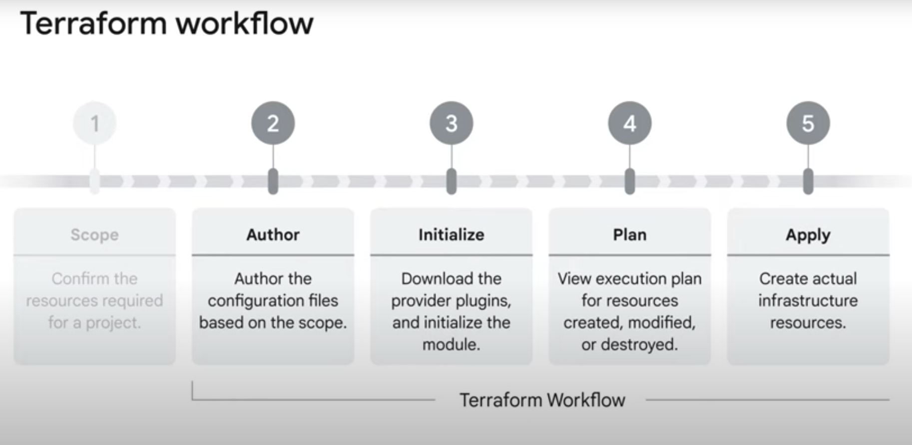

# Terraform configurations and Hashicorp Languages



## Hashicorp Configuration Language 

***Syntax***

```sh
<BLOCK TYPE> "<BLOCK Label>" "<BLOCK LABEL>" {
    # Block body
    <IDENTIFIER> = <EXPRESSION> #Argument
}

resource "resource_type" "resource_name" {
#Resource sepcific arguments
}
```

* `providers.tf` - Terraform downloads the provider plugin in the root configuration when the provider is decalred! 