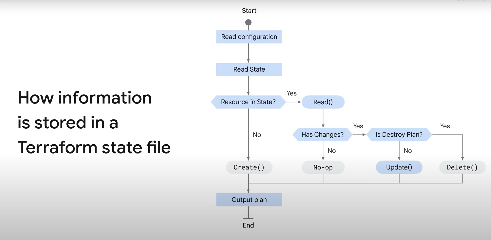

# Terraform state

* A state is medata repository of your infrastructure configuration
* A state file located by default in a local file named terraform.tfstate
* Terraform state stores the bindings between objects in a remote system and resource instances
* The state file records the indentity of an instance and updates or deletes in response to configuration changes

## Terraform State best practices

* USe remote state when working in teams | Remote state supports locking and versioning
* Dont store secrets in a state file | Avoid storing secrets in state because Terraform stores secrets values in plaintext
* Always encrypt the statefile | Use customer-supplies encryption keys to add a layer of protection.|
* Don't modify the terraform state file manually | Use the terraform state command when you need to modify a state.

* Command to migrate the state file from local to cloud storage bucket `terraform init -migrate-state`. 

## Terraform refresh 

The `terraform refresh` command is used to reconcile the state Terraform knows about (via its state file) with the real-world infrastructure. This can be used to detect any drift from the last-known state and to update the state file. This does not modify infrastructure, but does modify the state file. If the state is changed, this may cause changes to occur during the next plan or apply.