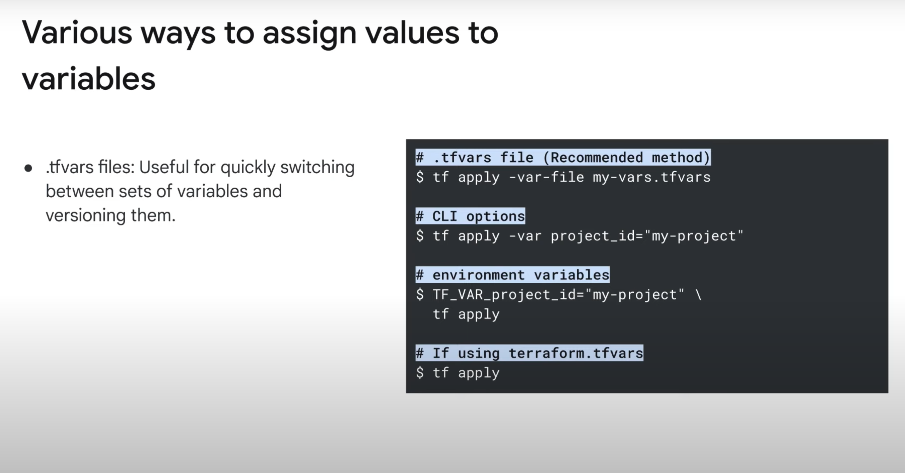

# Interview prep

## 1. How do you migrate to Terraform when the infra is already created? 

Answer: We need to write a main.tf with the provider configs

```sh
provider "aws" {
  region = "us-east-1"
}

import {
  id = <sample-instance-id>

  to = aws_instance.example
}

> terraform init
> terraform plan -generate-config-out=generate_resources.tf
> terraform import aws_instance.example <instance-id> #this command will create the tf state file. 
```

## 2. Drift detection

```sh
terraform refresh #this command detects the drift between the infrastructure changes and terraform state file. It updates the state file according to the infra changes.

```
* Define the terraform refresh command in a cron job.

## 3. If you want to run some script after the terraform provisioned the infra? 

***Answer*** - We can execute scripts using the local-exec and remote-exec provisioners

## 4. How terraform flow can be integrated with CICD pipeline? 

```sh
pipeline {
    agent any

    stages {
        stage('Checkout') {
            steps {
                git 'https://your-repo-url.git'
            }
        }

        stage('Terraform Init') {
            steps {
                dir('terraform') {
                    sh 'terraform init'
                }
            }
        }

        stage('Terraform Plan') {
            steps {
                dir('terraform') {
                    sh 'terraform plan -out=tfplan'
                }
            }
        }

        stage('Terraform Apply') {
            steps {
                dir('terraform') {
                    sh 'terraform apply -auto-approve tfplan'
                }
            }
        }
    }

    post {
        success {
            echo 'Terraform applied successfully!'
        }
        failure {
            echo 'Terraform apply failed.'
        }
    }
}
```

## 5. Your infra contains database passwords and other sensitive information. How can you manage secrets and sensitive data in Terraform ? 

***Answer*** Store it outside of the Scource code repo. 

## 6. You have 20 resources created through terraform config file. In that you wanted to delete one of the resources, how do you delete it ? 

***Answer*** 

`terraform destroy -target=aws_instance.myinstance`
## 7. What is advantage of using the Terraform's "count" feature over resource duplication? 

***Answer***

## 8. Explain about the terraform validate phase? 

***Answer***

* It comes between the plan and apply phase of terraform.
* Checks against the organization policies

## 9. Several ways to pass/define variables in Terraform. 




==================================

# Docker images

## 1. How to scan Docker images? 

`trivy image nginx:latest` 

`trivy image --severity CRITICAL nginx:1.18.0` - Only displays CRITCAL vulnerabilities with the image

`trivy image --ignore-unfixed nginx:1.18.0`
